# DAX Depo – Advanced DAX Analytics Dashboard

## Project Overview

This project demonstrates advanced DAX calculations, data modeling, time intelligence functions, filter context analysis, and matrix-based reporting using Power BI.

The dashboard was developed using a Sales and Returns dataset and follows a Star Schema data model. All analytical results are displayed using Matrix visuals as required by the project guidelines.

---

## Tools & Technologies

* Power BI Desktop
* Power Query
* DAX (Data Analysis Expressions)
* Data Modeling
* Time Intelligence Functions

---

## Dataset Tables

### Fact Tables

* Sales_Fact
* Returns_Fact

### Dimension Tables

* Customer_Dim
* Product_Dim
* Region_Dim
* Date_Dim

---

## Dashboard Screenshots

### Complete Dashboard View

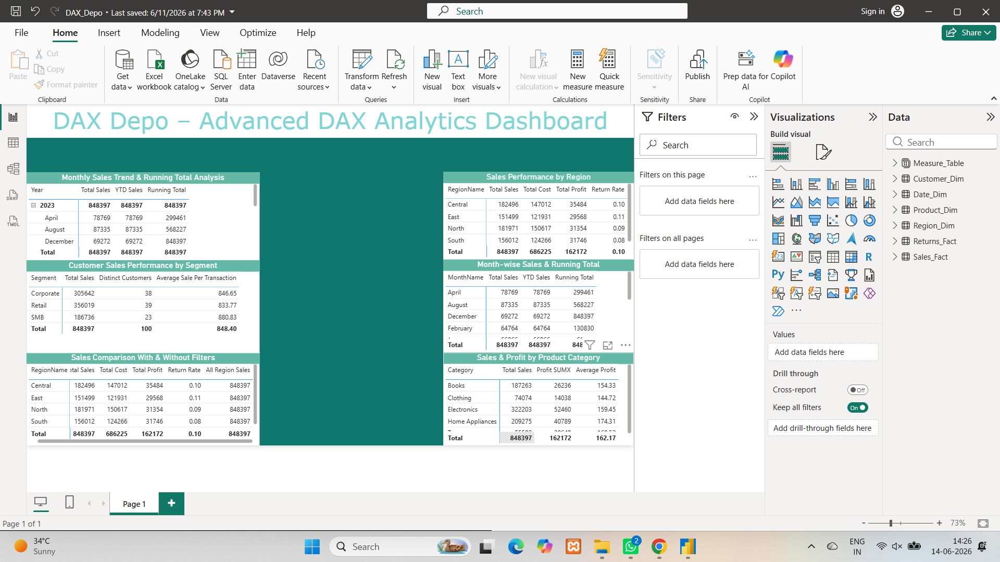

---

### Monthly Sales Trend & Running Total Analysis

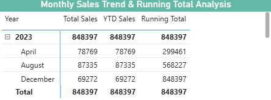

---

### Sales Performance by Region

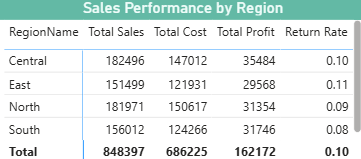

---

### Customer Sales Performance by Segment

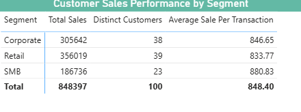

---

### Month-wise Sales & Running Total

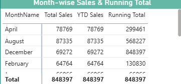

---

### Sales Comparison With & Without Filters

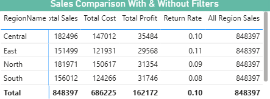

---

### Sales & Profit by Product Category

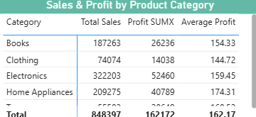

---

### Power Query Data Cleaning

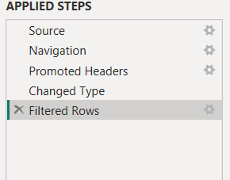

---

### Data Model & Relationships

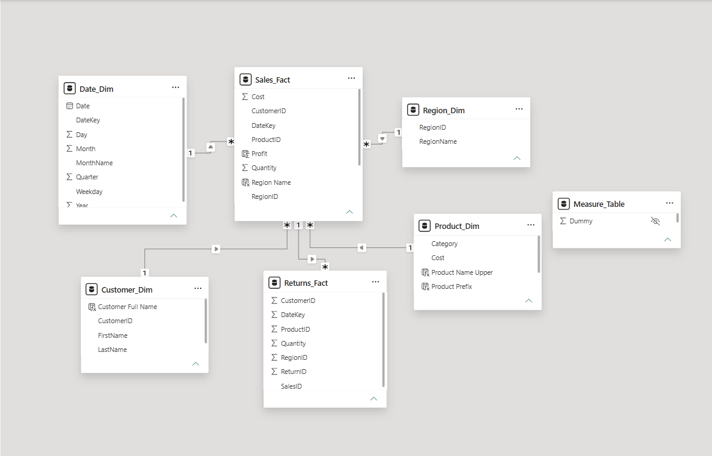

---

### Calculated Columns

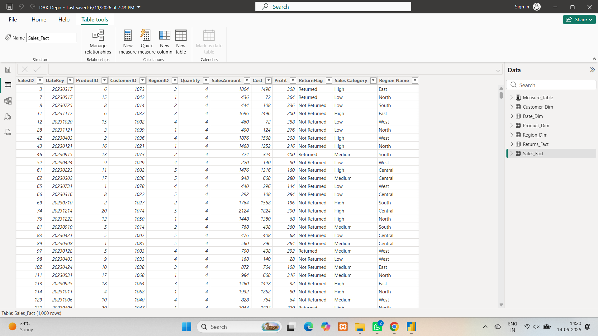

---

### Measure Table

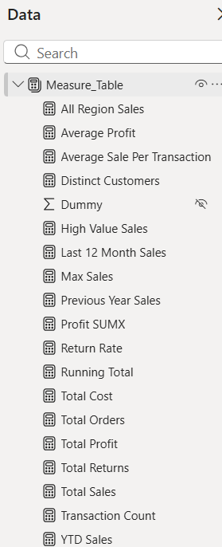

---


---

## Data Model

The project follows a Star Schema model.

### Relationships

* Sales_Fact[CustomerID] → Customer_Dim[CustomerID]
* Sales_Fact[ProductID] → Product_Dim[ProductID]
* Sales_Fact[RegionID] → Region_Dim[RegionID]
* Sales_Fact[DateKey] → Date_Dim[DateKey]
* Returns_Fact[SalesID] → Sales_Fact[SalesID]

---

## Power Query Transformations

The following transformations were performed:

* Removed blank rows
* Verified data types
* Cleaned dimension tables
* Validated keys for relationships
* Loaded cleaned data into Power BI

---

# Calculated Columns

## Profit

```DAX
Profit =
Sales_Fact[SalesAmount] - Sales_Fact[Cost]
```

## Customer Full Name

```DAX
Customer Full Name =
Customer_Dim[FirstName] & " " & Customer_Dim[LastName]
```

## Return Flag

```DAX
ReturnFlag =
IF (
    COUNTROWS (
        FILTER (
            Returns_Fact,
            Returns_Fact[SalesID] = Sales_Fact[SalesID]
        )
    ) > 0,
    "Returned",
    "Not Returned"
)
```

---

# DAX Measures

## Total Sales

```DAX
Total Sales =
SUM(Sales_Fact[SalesAmount])
```

## Total Cost

```DAX
Total Cost =
SUM(Sales_Fact[Cost])
```

## Total Profit

```DAX
Total Profit =
SUM(Sales_Fact[Profit])
```

## Total Orders

```DAX
Total Orders =
COUNTROWS(Sales_Fact)
```

## Total Returns

```DAX
Total Returns =
COUNTROWS(Returns_Fact)
```

## Return Rate

```DAX
Return Rate =
DIVIDE(
    [Total Returns],
    [Total Orders],
    0
)
```

## Average Sale Per Transaction

```DAX
Average Sale Per Transaction =
AVERAGE(Sales_Fact[SalesAmount])
```

## Distinct Customers

```DAX
Distinct Customers =
DISTINCTCOUNT(Sales_Fact[CustomerID])
```

## Max Sales

```DAX
Max Sales =
MAX(Sales_Fact[SalesAmount])
```

## Transaction Count

```DAX
Transaction Count =
COUNTX(
    Sales_Fact,
    Sales_Fact[SalesID]
)
```

---

# Time Intelligence Measures

## YTD Sales

```DAX
YTD Sales =
TOTALYTD(
    [Total Sales],
    Date_Dim[Date]
)
```

## Previous Year Sales

```DAX
Previous Year Sales =
CALCULATE(
    [Total Sales],
    SAMEPERIODLASTYEAR(Date_Dim[Date])
)
```

## Running Total

```DAX
Running Total =
CALCULATE(
    [Total Sales],
    FILTER(
        ALL(Date_Dim),
        Date_Dim[Date] <= MAX(Date_Dim[Date])
    )
)
```

## Last 12 Month Sales

```DAX
Last 12 Month Sales =
CALCULATE(
    [Total Sales],
    DATESINPERIOD(
        Date_Dim[Date],
        MAX(Date_Dim[Date]),
        -12,
        MONTH
    )
)
```

---

# Advanced DAX Functions

## ALL Function

```DAX
All Region Sales =
CALCULATE(
    [Total Sales],
    ALL(Region_Dim)
)
```

## FILTER Function

```DAX
High Value Sales =
CALCULATE(
    [Total Sales],
    FILTER(
        Sales_Fact,
        Sales_Fact[SalesAmount] > 1000
    )
)
```

## SUMX Function

```DAX
Profit SUMX =
SUMX(
    Sales_Fact,
    Sales_Fact[SalesAmount] -
    Sales_Fact[Cost]
)
```

## AVERAGEX Function

```DAX
Average Profit =
AVERAGEX(
    Sales_Fact,
    Sales_Fact[SalesAmount] -
    Sales_Fact[Cost]
)
```

---

# Additional DAX Functions

## SWITCH

```DAX
Sales Category =
SWITCH(
    TRUE(),
    Sales_Fact[SalesAmount] < 500,"Low",
    Sales_Fact[SalesAmount] < 1000,"Medium",
    "High"
)
```

## RELATED

```DAX
Region Name =
RELATED(Region_Dim[RegionName])
```

## UPPER

```DAX
Product Name Upper =
UPPER(Product_Dim[ProductName])
```

## LEFT

```DAX
Product Prefix =
LEFT(Product_Dim[ProductName],3)
```

---

# Dashboard Components

## 1. Sales Performance by Region

Displays:

* Total Sales
* Total Cost
* Total Profit
* Return Rate

---

## 2. Monthly Sales Trend & Running Total Analysis

Displays:

* Total Sales
* YTD Sales
* Running Total

---

## 3. Sales Comparison With & Without Filters

Demonstrates:

* ALL() Function
* Filter Context Analysis

---

## 4. Month-wise Sales & Running Total

Displays:

* Monthly Sales
* YTD Sales
* Running Total

---

## 5. Sales & Profit by Product Category

Displays:

* Total Sales
* Profit SUMX
* Average Profit

---

## 6. Customer Sales Performance by Segment

Displays:

* Total Sales
* Distinct Customers
* Average Sale Per Transaction

---

# Key Learning Outcomes

* Data Modeling using Star Schema
* DAX Calculated Columns
* DAX Measures
* Time Intelligence Analysis
* Filter Context Manipulation
* Iterator Functions (SUMX, AVERAGEX)
* Relationship Functions (RELATED)
* Matrix-Based Reporting
* Power Query Data Cleaning

---

## Author

**Nilay Ahir**

Power BI | Data Analytics | DAX | Business Intelligence
